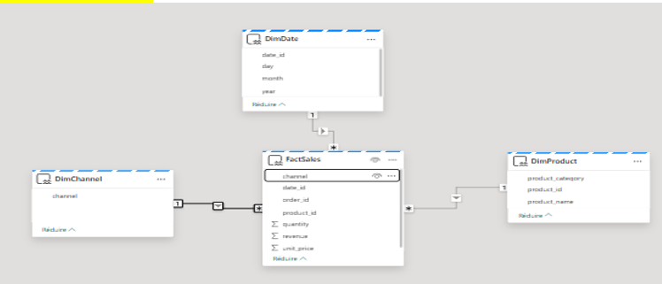
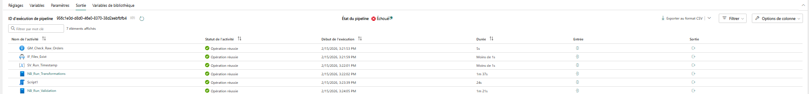
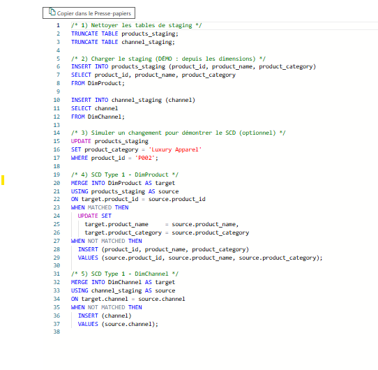
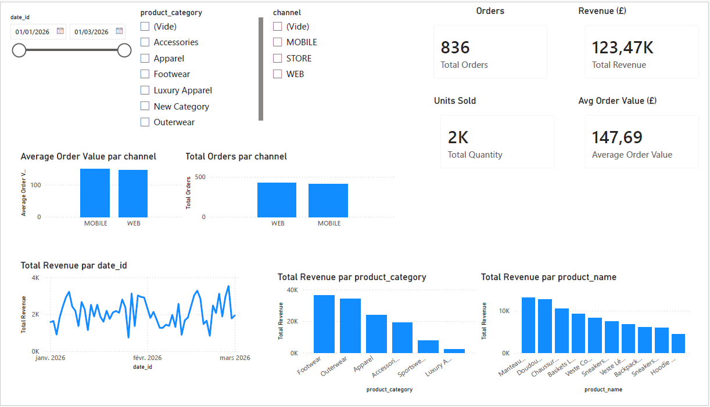
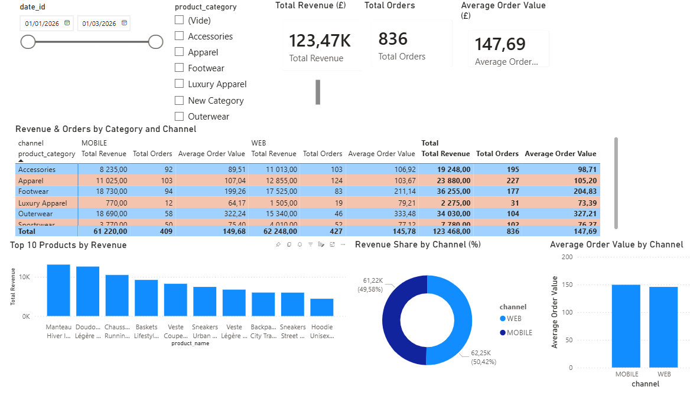
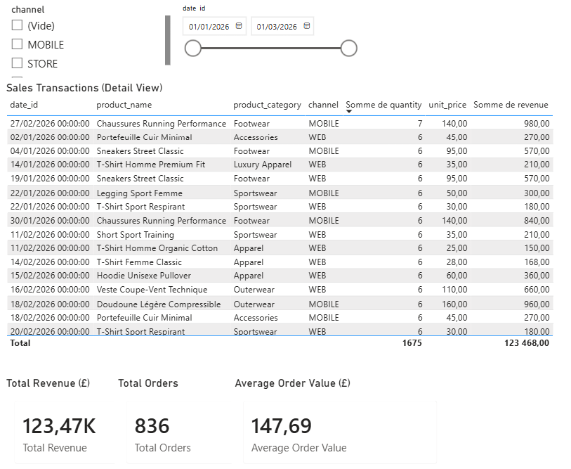
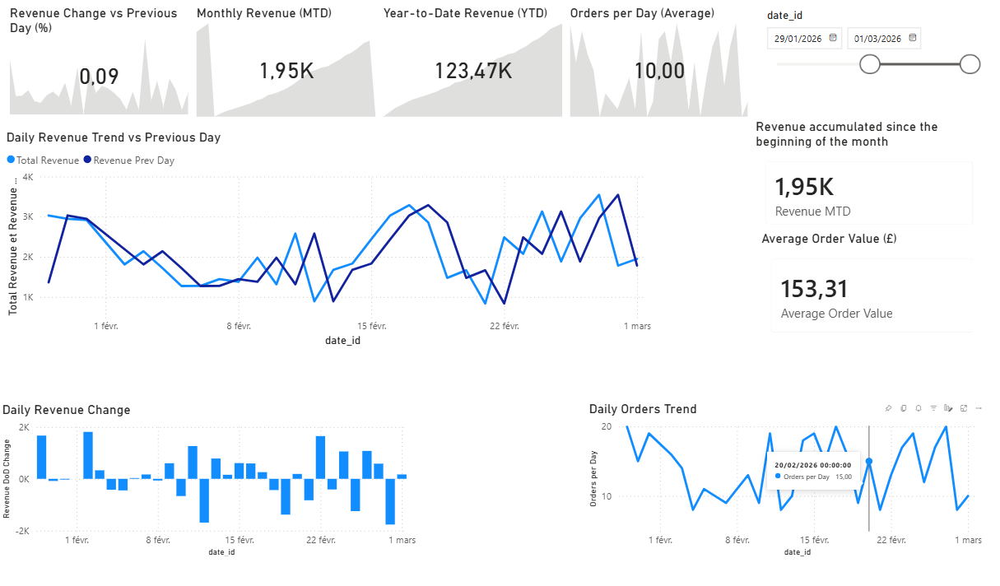

# Microsoft Fabric Sales Analytics

## Overview
End-to-end analytics demo built with **Microsoft Fabric**. Daily sales CSVs are ingested into a **Lakehouse**, transformed with **Spark** into curated **Delta tables**, modeled in a **Star Schema** (Warehouse), and visualized in **Power BI**.

## Architecture (Medallion)
**Daily CSV → Bronze (raw) → Silver (clean) → Gold (Warehouse / Star Schema) → Semantic model → Power BI**

| Layer | Fabric object | Main output |
|---|---|---|
| **Bronze** | Lakehouse (raw) | `sales_orders_raw` |
| **Silver** | Lakehouse (curated) | `sales_orders_clean` |
| **Gold** | Warehouse | `FactSales`, `DimDate`, `DimChannel` (+ product dimension) |

## Data Model (Star Schema)

## Data Pipeline (Microsoft Fabric)
The pipeline orchestrates ingestion + transformations + Warehouse steps.

## Warehouse (SQL) — SCD
Dimensions are maintained using SCD patterns:

| Dimension | SCD | Purpose | Implementation |
|---|---:|---|---|
| `DimChannel` | Type 1 | Keep latest values | `MERGE` (overwrite/insert) |
| `DimProduct_SCD2` | Type 2 | Keep full history (e.g., category changes) | Close current row + insert new version (`start_date`, `end_date`, `is_current`) |

## Power BI Reports

## KPIs
- Total Revenue (£)
- Total Orders
- Units Sold
- Average Order Value (£)
- Breakdown by channel, product category, and time

## Tech Stack
Microsoft Fabric (OneLake, Lakehouse, Warehouse, Pipelines), Spark (PySpark), Delta Lake, SQL, Power BI.

## Demo vs Production
This repository is **production-style demo**:
- Input CSVs are **sample files** (manual/simulated ingestion).
- The pipeline is not necessarily connected to an automated daily landing zone.

A fully productionized version would typically add:
- Automated ingestion (OneLake/ADLS/S3/API)
- Scheduled/triggered runs + idempotent processing
- Monitoring/alerts and basic data quality checks
- Automated semantic model / Power BI refresh
